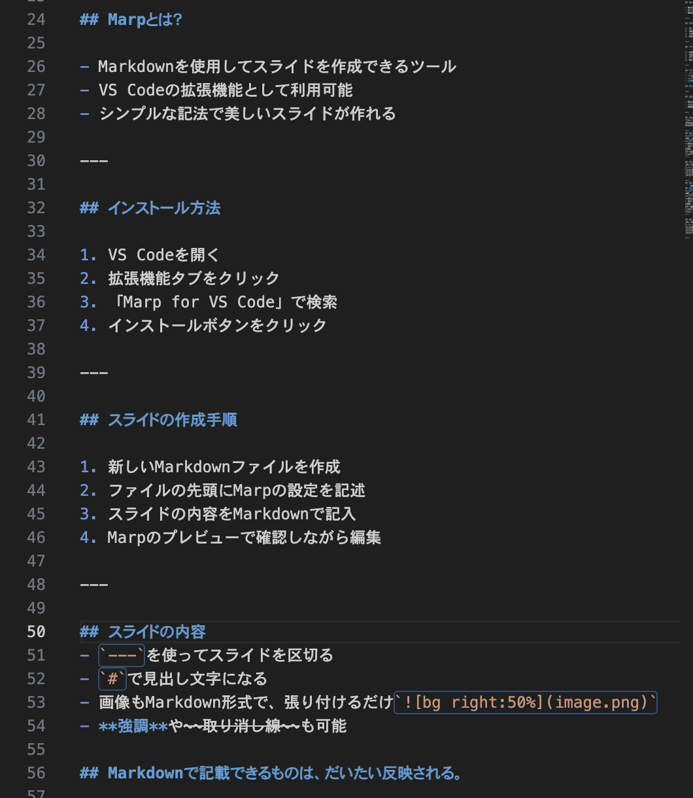
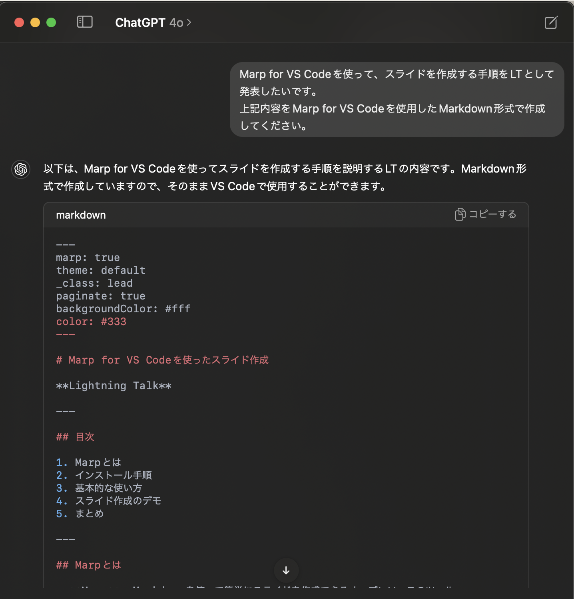

# Marp for VS Code を使ったスライド作成

かねこち

---

## アジェンダ

1. Marp とは？
2. インストール方法
3. スライド作成手順
4. スライドの内容
5. まとめとおまけ

---

## Marp とは？

- Markdown を使用してスライドを作成できるツール
- VS Code の拡張機能として利用可能
- シンプルな記法で美しいスライドが作れる

---

## インストール方法

1. VS Code を開く
2. 拡張機能タブをクリック
3. 「Marp for VS Code」で検索
4. インストールボタンをクリック

---

## スライドの作成手順

1. 新しい Markdown ファイルを作成
2. ファイルの先頭に Marp の設定を記述
3. スライドの内容を Markdown で記入
4. Marp のプレビューで確認しながら編集

---

## スライドの内容



- `---`を使ってスライドを区切る
- `#`で見出し文字になる
- 画像も Markdown 形式で、張り付けるだけ``
- **強調**や~~取り消し線~~も可能

## Markdown で記載できるものは、だいたい反映される。

---

## 最後に

- Marp は Markdown が書ければ簡単にスライドが作成できる
- 今回の LT で Marp の基本を学べたことでしょう
- さあ、あなたも Marp でプレゼンテーションを始めましょう！

---

## Appendix


お気づきかもしれませんが。。。
ChatGPT と組みわせると、スライドが一瞬で作成できます。

---

## 文字装飾/Emoji

**太字**
_イタリック(Italic)_
**_太字兼イタリック_**
~~取り消し線~~

> 引用
> お疲れ様でした:+1:(`:+1:`)
> おめでとうございます:tada:(`:tada:`)

## 検討事項:thinking:(`:thinking:`)

## 表/Syntax Highlighting

| #(中央揃え) | 列 1(左揃え) | 列 2(右揃え) |
| :---------: | :----------- | -----------: |
|      1      | A            |            B |
|      2      | C            |            D |
|      3      | E            |            F |

---

## Markdown 書式

```markdown
## 文字装飾/Emoji

**太字**
_イタリック(Italic)_
**_太字兼イタリック_**
~~取り消し線~~

> 引用
> お疲れ様でした:+1:(`:+1:`)
> おめでとうございます:tada:(`:tada:`)
> 検討事項:thinking:(`:thinking:`)

## 

## 表/Syntax Highlighting

| #(中央揃え) | 列 1(左揃え) | 列 2(右揃え) |
| :---------: | :----------- | -----------: |
|      1      | A            |            B |
|      2      | C            |            D |
|      3      | E            |            F |

---
```
